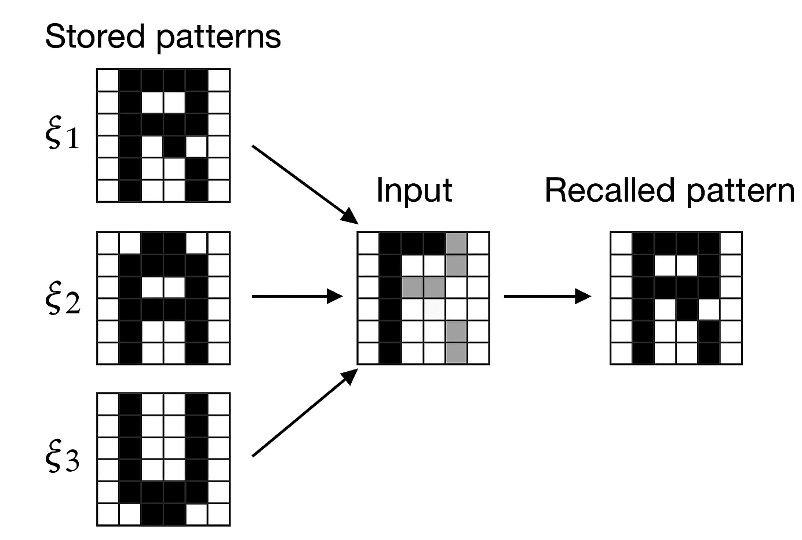
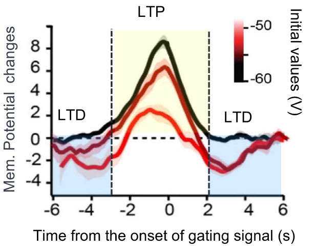
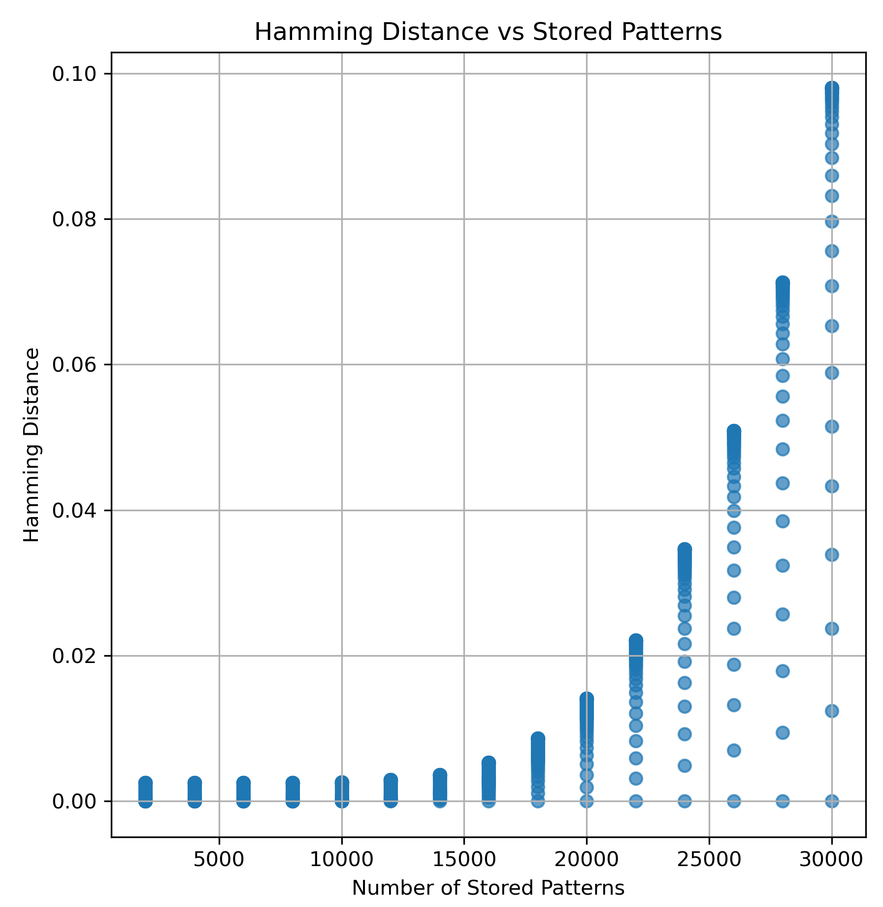
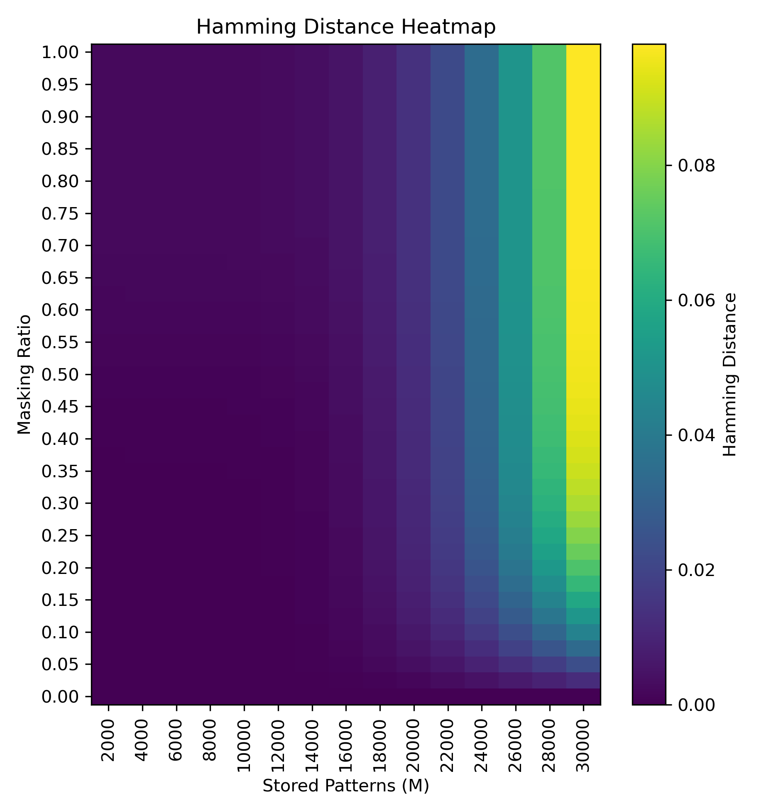
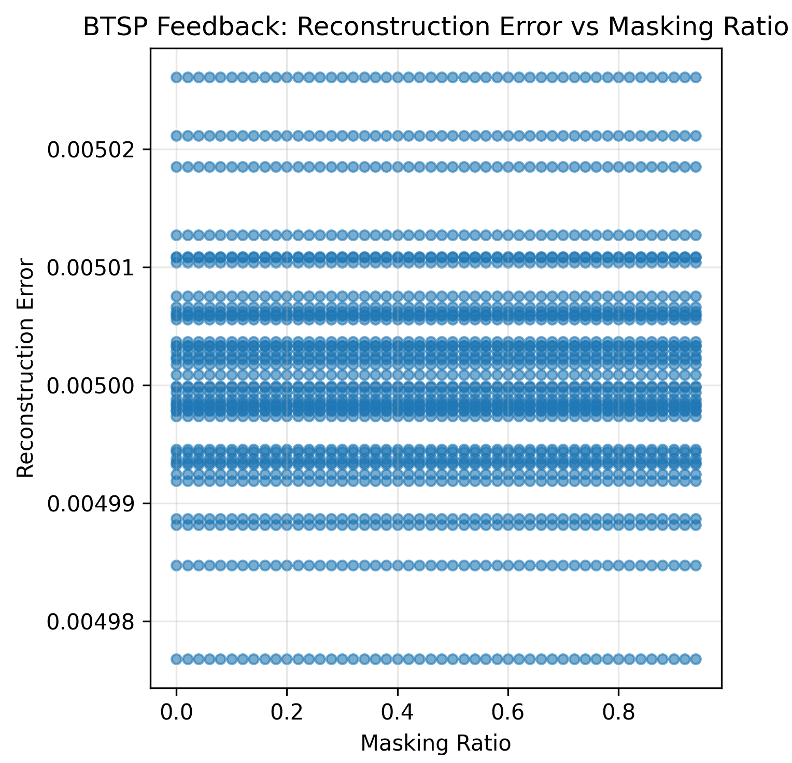
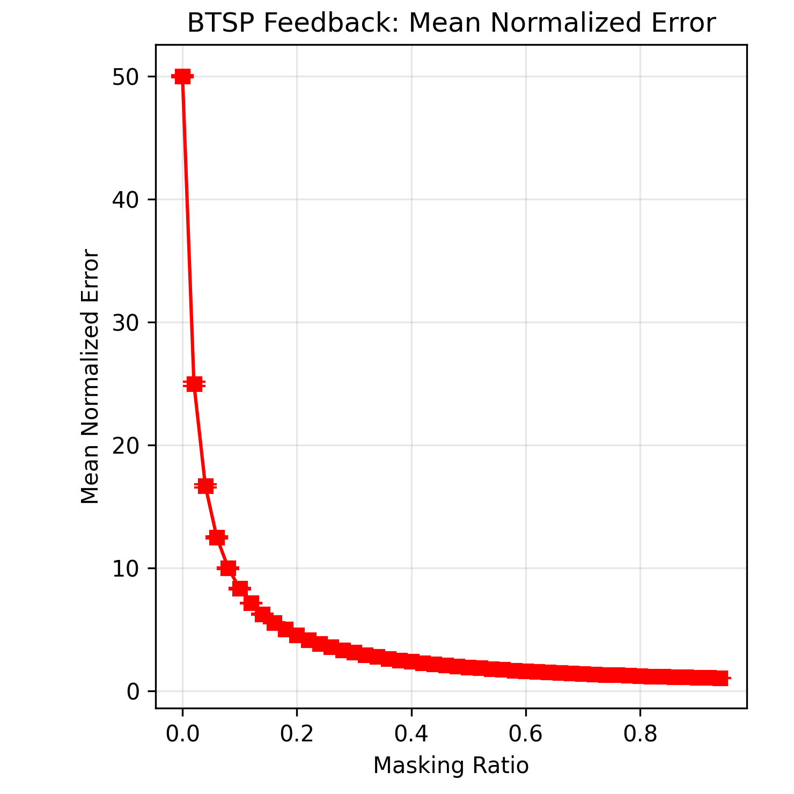

# Simple BTSP
<style>
span.subtitle{
  font-size: 1.6rem;
  color: dark-grey;
}
</style>

<span class="subtitle">
Presenter: Tong Wu
<br>
2025.6.8
</span>

<div class="absolute bottom-4 right-4">
  <a href="https://github.com/yjwu17/simpleBTSP" target="_blank">
    
  </a>
  Code repository
</div>
---
layout: intro
transition: fade-out
---
## A simple model for Behavioral Time Scale Synaptic Plasticity (BTSP) provides content addressable memory with binary synapses and one-shot learning
<br> </br>

- Yujie Wu & Wolfgang Maass

<div class="absolute bottom-4 right-4">
  <a href="https://doi.org/10.1038/s41467-024-55563-6" target="_blank">
    Paper DOI
  </a>
</div>
---
layout: two-cols
transition: fade-out
---
<style>
    .section2 h2 {
        background-color: #2B90B6;
        background-image: linear-gradient(45deg, #4EC5D4 10%, #146b8c 20%);
        background-size: 100%;
        -webkit-background-clip: text;
        -moz-background-clip: text;
        -webkit-text-fill-color: transparent;
        -moz-text-fill-color: transparent;
    }
</style>
<div class="absolute top-40 left-8">
 <div class="section2">
  <h2>Background & Motivation</h2>
 </div>
 <br> </br>

  - How is memory stored in the brain?
  - What is Content Addressable Memory(CAM)?
  - What is BTSP and why is it important?
  - Key focus: how a simple BTSP model enables CAM?

<br> </br>
<br> </br>
<br> </br>
Note that the author builds a CAM with **<u>binary weights</u>** and **<u>one-shot learning</u>** capability, which is different from traditional CAMs that use floating-point weights and require multiple training iterations.
</div>


::right::
<div class="absolute top-36 right-8">
  
</div>


---
layout: default
transition: fade-out
---
## BTSP(**B**ehavioral **T**ime-Scale **S**ynaptic **P**lasticity)

<head lang="en">
    <title></title>
    <style>
        .Cap p:first-letter{
            display:block;
            margin:5px 0 0 5px;
            float:left;
            color:#FF3366;
            font-size:60px;
            font-family:Georgia;
        }
    </style>
</head>
<br> </br>
<div class="Cap">
<p>Strongly differing from traditional Hebbian rule and STDP(Spike-Timing-Dependent Plasticity), BTSP is a behavioral time-scale synaptic weight update rule. It has been demonstrated in the area CA1 of the hippocampus.
</p>
</div>

Its key features include:
- **Independent of the firing of the postsynaptic neuron**: \
Instead, stochastic gating signals from another brain area.
- **One-shot learning**:  
Effective with a single presentation of the input.
- **Simple weight update rule**: \
Primarily dependent on the preceding weight value.
- **Time-scale of seconds**: \
Enables episodic memory formation.

---
layout: two-cols
transition: slide-left
---
## Model Overview

- Input layer: CA3(&EC3) pyramidal cells (sparse binary input)
- Memory layer: CA1 McCulloch-Pitts neurons (binary activations)
- BTSP rule applied in feedforward path (CA3 → CA1)
- Hebbian-like feedback connections enable input reconstruction

<div class="absolute bottom-10 left-16">
  
</div>

::right::
<br> </br>
<br> </br>
<br> </br>
<br> </br>
<br> </br>
<br> </br>
<br> </br>
<br> </br>
<br> </br>
<br> </br>
$$ {1,2|3|all}
\begin{aligned}
    \delta w_{ij} = 
    \left\{
      \begin{array}{rcl}
        +1     &   &\text{ if } w_{ij}=0 &                            \\
        -1     &   &\text{ if } w_{ij}=1 &\text{ with probability }0.5 \\
        0      &     &\                &\text{otherwise}                   \\
      \end{array}
    \right.
\end{aligned}
$$
Each memory item is learned one-shot, and the plateau potential meets a small part of the neurons at a probability of $0.005$.

---
layout: default
transition: slide-up
---
## Reproduction Goals & Scope

<br> </br>
### 🎯 Reproduction Focus

> We focused on reproducing the core mechanisms proposed in the paper:
> - Feedforward one-shot learning using the simple BTSP rule
> - Input reconstruction using Hebbian feedback connections

<br> </br>
<br> </br>
Due to the limited availability of computational resources, we were unable to fully reproduce the experiments in the paper with the original model scale. Ultimately, we had to reduce the model size and optimize the GPU usage of the code(I do some paralleling to the training process). As a result of this reduction, the performance difference between HFN and BTSP became marginal, and thus our reproduction cannot be considered complete. <u>However</u>, **we were able to confirm that the model exhibits most of the characteristics described in the paper**, although we could not verify its performance at the original scale.

---
layout: default
transition: slide-right
---
### 🔎 Feedforward Learning


- **Hamming Distance increases with number of stored patterns**: indicates growing interference
- **Heatmap shows error increases with both storage size and input masking ratio**


```python{none|1|2,3|all}
plateau_winner1 = (torch.rand(M, 1, n, device=device) <= fq_half).to(precison)
plateau_winner2 = (torch.rand(M, 1, n, device=device) <= fq_half / (1 - fq_half)).to(precison)
plateau_winner2 = plateau_winner2 * (1 - plateau_winner1)
```
```python{none|1,2,3|4|5|all}
for idx in range(M):
    inpx = data[:, idx].reshape(-1, 1)
    W = ((W | (inpx @ plateau_winner1[idx] >= 1)) & ~(inpx @ plateau_winner2[idx] > 1))
W = W % 2
W = W_mask & W
```
Hamming distance is calculated to measure the difference between the input and the stored patterns:
$$
\text{Hamming Distance} = \frac{1}{N} \sum_{i=1}^{N} |x_i - w_i|
$$
The results of the feedback which we will show later indicate that the model can get close to the original input. In other words, the model shows attractor dynamics on the masked input.
---
layout: default
transition: slide-left
---
📊 Visualizations:
<div grid="~ cols-2 gap-2" m="-t-2">


</div>

---
layout: default
---
### 🔁 Feedback-Based Reconstruction Results

- **Reconstruction error remains stable across masking ratios**
- **Normalized error decreases as masking ratio increases**: masking may suppress noisy components

```python{1,2|3,4,5,6|8,9,10,11,12,13,14,15,17|all}
input_sum_ca1 = X_masked @ W_feed
reconstruct_results = []
if masked_ratio <= 0.65:
  fixed_M = 2e4
  opt_thr1_fitting = f_thr2(fixed_M, masked_ratio)
  opt_thr3_fitting = f_thr1(fixed_M, masked_ratio)

for thr_ca1 in [opt_thr1_fitting] * 2:
  y_ = (input_sum_ca1 >= thr_ca1).to(precison)
  X_projected = y_ @ W_back
  for thr_ca3 in [opt_thr3_fitting] * 2:
    tmp = (X_projected >= thr_ca3).to(precison)
    err0 = (tmp - X).abs().mean()
    items = [thr_ca1, thr_ca3, err0.item(), err1.item()]
    reconstruct_results.append(items)

reconstruct_array = np.array(reconstruct_results)
```


---
layout: default
---
📊 Visualizations:
<div grid="~ cols-2 gap-2" m="-t-2">


</div>
> These results demonstrate that BTSP + Hebbian feedback enables robust, one-shot input completion.
---
layout: default
---
## Functional Analysis I: Storage Capability

- Sparse input → sparse, stable memory representations
- Supports online, one-shot learning
- Works with binary weights—no need for high-precision values

## Functional Analysis II: Recall & Real-Time Inference

- Accurate recall with partial/damaged cues
- No convergence steps needed
- Feedback pathway enables direct input reconstruction

## To be completed: Functional Analysis III
- Encourages representational repulsion for similar inputs
- Better suited for fine-grained classification compared to RP or Hopfield networks
---
layout: default
transition: fade-out
---

<div class="section2">
  <h2>Summary & Outlook</h2>
 </div>

- Simple BTSP rule → efficient CAM with one-shot learning
- Supports fast recall, partial cue completion, and representation separation
- Suitable for energy-efficient, on-chip neuromorphic implementation using binary weights

**Future Work**:
- Explore scaling to larger models
- Extend the model: the original model is too simple. Its structure is induced from the biological strcture. Perhaps we could change the model's weights from binary to ternary, which would correspond to the existence of excitatory and inhibitory neurons. And this will promisingly improve the model's performance.

---
layout: quote
---
## References
[1] Gerstner, W., Kistler, W. M., Naud, R., & Paninski, L. (2014). Neuronal dynamics: From single neurons to networks and models of cognition. Cambridge University Press.\
[2] Cone, I. & Shouval, H. Z. Behavioral time scale plasticity of place fields: mathematical analysis. Front. Computational Neurosci. 15, 640235 (2021).
---
layout: end
---
# Thank you for your attention!